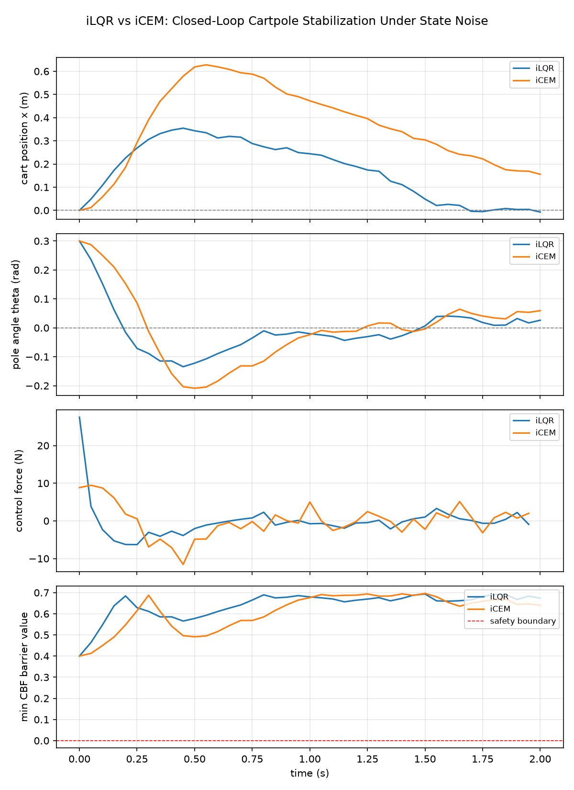

# Differentiable MPC Engine

A batched, fully differentiable **Model Predictive Control (MPC)** research engine built on PyTorch. It implements analytical continuous-time dynamics, **Control Barrier Function (CBF)** safety constraints, and two trajectory optimizers spanning the two dominant MPC paradigms — the gradient-based **iLQR** (iterative LQR) and the sampling-based **iCEM** (Iterative Cross-Entropy Method) — evaluated on the classic underactuated cartpole stabilization benchmark.

Every numerical component — dynamics integration, cost evaluation, and barrier functions — is a native `torch.Tensor` operation, so gradients flow through rollouts by construction and every optimizer is batch-parallel across independent problem instances.

## Table of Contents

- [Features](#features)
- [Repository Structure](#repository-structure)
- [1. Cartpole Dynamics](#1-cartpole-dynamics)
- [2. Control Barrier Functions](#2-control-barrier-functions)
- [3. iLQR Optimizer](#3-ilqr-optimizer)
- [4. iCEM Optimizer](#4-icem-optimizer)
- [Benchmark Results](#benchmark-results)
- [Installation](#installation)
- [Usage](#usage)
- [Testing](#testing)
- [Design Notes & Limitations](#design-notes--limitations)
- [References](#references)

## Features

- **Batched analytical dynamics** — RK4/Euler integration of the standard cartpole ODE, differentiable end-to-end.
- **Control Barrier Functions** — obstacle avoidance, state/input box constraints, and the discrete-time CBF forward-invariance condition, all autograd-compatible.
- **iLQR** — Riccati backward pass with autograd-derived Jacobians/Hessians (no hand-coded linearization), Levenberg–Marquardt regularization, and backtracking line search.
- **iCEM** — zeroth-order population search with fully vectorized `(batch × population)` rollouts, elite selection, and distribution refitting.
- **Optional CBF penalties** — both optimizers accept a barrier function and fold constraint violation into the cost as a squared-hinge penalty.
- **Closed-loop benchmark harness** — receding-horizon evaluation of both optimizers under injected Gaussian state noise, with latency, tracking-error, and cost diagnostics plus comparison plots.
- **48 passing unit/integration tests** covering shapes, gradient correctness (checked against hand-derived analytic gradients, not just "is not None"), constraint violation detection, and closed-loop stabilization.

## Repository Structure

```
differentiable-mpc/
├── src/
│   ├── dynamics/
│   │   └── cartpole.py       # CartpoleDynamics, CartpoleParams
│   ├── constraints/
│   │   └── cbf.py            # BarrierFunction, ObstacleAvoidanceCBF, BoxConstraintCBF, ...
│   └── optimizers/
│       ├── ilqr.py           # ILQR, ILQRResult, QuadraticCost
│       └── icem.py           # ICEM, ICEMResult
├── experiments/
│   ├── benchmark_mpc.py      # Closed-loop iLQR vs. iCEM benchmark runner
│   ├── plot_diagnostics.py   # Multi-panel diagnostic plotting
│   └── runs/                 # Generated comparison plots (PNG)
├── tests/                    # pytest suite (48 tests)
└── requirements.txt
```

## 1. Cartpole Dynamics

**`src/dynamics/cartpole.py`** — `CartpoleDynamics`

State convention `[x, ẋ, θ, θ̇]` (cart position/velocity, pole angle/angular velocity from the upright vertical); control convention `[F]` (horizontal force on the cart). The continuous-time equations of motion are the standard frictionless cartpole model (Florian; OpenAI Gym's `CartPole` physics; the same model used in Amos & Kolter's differentiable MPC work):

```math
\ddot\theta = \frac{g\sin\theta - \cos\theta \cdot \dfrac{F + m_p l \dot\theta^2 \sin\theta}{m_c + m_p}}{l\left(\dfrac{4}{3} - \dfrac{m_p \cos^2\theta}{m_c + m_p}\right)}, \qquad
\ddot{x} = \frac{F + m_p l \dot\theta^2 \sin\theta}{m_c + m_p} - \frac{m_p l \ddot\theta \cos\theta}{m_c + m_p}
```

- **Integration**: `step()` supports 4th-order Runge–Kutta (default) or explicit Euler; `rollout()` chains `step()` over a control sequence.
- **Batching**: every method operates on `[batch, dim]` tensors with no Python loop over the batch axis.
- **Autograd**: no `.detach()` anywhere in the dynamics — gradients propagate through arbitrarily long rollouts.

```python
from src.dynamics.cartpole import CartpoleDynamics

dynamics = CartpoleDynamics()
state = torch.tensor([[0.0, 0.0, 0.2, 0.0]])      # [batch=1, state_dim=4]
control = torch.tensor([[1.0]])                     # [batch=1, control_dim=1]
next_state = dynamics.step(state, control, dt=0.05, method="rk4")
```

## 2. Control Barrier Functions

**`src/constraints/cbf.py`**

A barrier function defines a safe set `{x : h(x) ≥ 0}`. All barrier values are batched tensors that stay in the autograd graph — no detaching — so safety terms can be embedded directly in a differentiable cost.

| Class | Purpose |
|---|---|
| `ObstacleAvoidanceCBF` | `h_i(x) = \|p(x) - obstacle_i\|^2 - r^2` — squared distance to point obstacles (avoids the `sqrt` gradient singularity at zero separation). |
| `BoxConstraintCBF` / `StateConstraintCBF` / `InputConstraintCBF` | Elementwise lower/upper bounds (e.g. cart position, pole angle, force limits), one-sided bounds supported via `±inf`. |
| `CombinedBarrier` | Concatenates several barriers into one constraint set. |
| `discrete_cbf_condition(h_t, h_{t+1}, α)` | The actual discrete-time CBF forward-invariance inequality, `h(x_{t+1}) - (1-\alpha) h(x_t) \geq 0`, for enforcing safety along a planned trajectory. |

```python
from src.constraints.cbf import ObstacleAvoidanceCBF

obstacle = ObstacleAvoidanceCBF(torch.tensor([[1.5]]), safe_radius=0.3, position_indices=(0,))
is_safe = obstacle.is_safe(state)   # bool tensor, per batch element
```

## 3. iLQR Optimizer

**`src/optimizers/ilqr.py`** — `ILQR`

A batched iterative LQR / DDP-style trajectory optimizer. Unlike textbook implementations, dynamics Jacobians and cost Hessians are obtained via **PyTorch autograd** (double backward for the Hessians) rather than hand-derived — any differentiable dynamics or cost module plugs in without extra math.

**Backward pass** (Riccati recursion), at each timestep:

```math
Q_x = l_x + f_x^\top V_x', \quad Q_u = l_u + f_u^\top V_x', \quad
Q_{xx} = l_{xx} + f_x^\top V_{xx}' f_x, \quad Q_{uu} = l_{uu} + f_u^\top V_{xx}' f_u, \quad Q_{ux} = l_{ux} + f_u^\top V_{xx}' f_x
```

`Q_{uu}` is regularized (`Q_{uu} + \mu I`) with an eigenvalue-based positive-definiteness check; feedforward/feedback gains solve `Q_{uu} k = -Q_u` and `Q_{uu} K = -Q_{ux}` via `torch.linalg.solve`.

**Forward pass**: backtracking line search over `α ∈ {1, 0.5, 0.25, ...}`, applying `u = ū + αk + K(x - x̄)` and accepting the first step that reduces total cost.

**Optional CBF penalty**: pass `barrier=` and `barrier_weight=` to add `w · relu(-h(x))²` to the running cost.

```python
from src.optimizers.ilqr import ILQR, QuadraticCost

cost = QuadraticCost(Q=torch.diag(torch.tensor([10., 1., 50., 1.])), R=torch.diag(torch.tensor([0.01])))
solver = ILQR(dynamics, cost.running_cost, cost.terminal_cost, horizon=30, dt=0.05)
result = solver.optimize(initial_state)   # ILQRResult(states, controls, cost_history, converged, iterations)
```

## 4. iCEM Optimizer

**`src/optimizers/icem.py`** — `ICEM`

A batched, gradient-free (zeroth-order) trajectory optimizer. Each iteration: sample a population of control sequences from a diagonal Gaussian `N(mean, std²)`, roll every sample out through the dynamics, score with `running_cost` + `terminal_cost` (+ optional CBF penalty), keep the lowest-cost elite fraction, and refit `mean`/`std` from elite statistics.

The outer **batch** dimension (independent problems) and the inner **population** dimension (samples per problem) are flattened into a single mega-batch for the rollout, so sampling → simulation → elite selection is fully vectorized with no Python loop over samples — only over the (small) horizon and CEM iteration count. Because CEM needs no gradients, the whole search runs under `torch.no_grad()`.

```python
from src.optimizers.icem import ICEM

solver = ICEM(dynamics, cost.running_cost, cost.terminal_cost, horizon=20, dt=0.05,
               num_samples=800, num_elites=80, num_iterations=30, init_std=2.0)
result = solver.optimize(initial_state)   # ICEMResult(states, controls, mean, std, cost_history, iterations)
```

## Benchmark Results

**`experiments/benchmark_mpc.py`** runs both optimizers as closed-loop, receding-horizon controllers from an identical offset cartpole state (`θ₀ = 0.3 rad`), replanning every control cycle:

1. Solve from the current *true* state (warm-started from the previous plan, shifted by one step).
2. Apply only the first action to the true dynamics.
3. Inject Gaussian process noise into the resulting state before the next replan — this is what tests robustness under uncertainty in closed loop, rather than a single open-loop plan.
4. Repeat for 40 control cycles (`dt = 0.05s`, 2s horizon) under a shared `CombinedBarrier` (an obstacle plus cart/pole state bounds).

Reproduce with `./venv/bin/python -m experiments.benchmark_mpc`:

| Controller | Latency mean (ms) | Latency std (ms) | Final tracking error | Total cost |
|---|---:|---:|---:|---:|
| **iLQR** | 370.407 | 328.549 | **0.0704** | **64.98** |
| **iCEM** | **53.858** | **0.954** | 0.3359 | 138.95 |



**Interpretation:** iLQR converges the cart back to the origin and the pole to upright with an order of magnitude better final accuracy and lower total cost, but at ~7× the mean per-cycle latency and with high latency variance — each solve reruns Levenberg–Marquardt regularization retries and a variable number of Riccati iterations to convergence. iCEM is dramatically faster and strikingly *consistent* in latency (sub-millisecond std, since its cost per solve is a fixed number of vectorized rollouts regardless of trajectory difficulty), but settles for a visibly less precise trajectory — consistent with a broader finding from developing this repo: a pure random-sampling CEM population, even at 2000+ samples, converges to a measurably worse local optimum than iLQR on this same problem over a 20–30 step horizon. This is an expected property of zeroth-order search over a moderate-dimensional action sequence, not an implementation defect — it is the classic sample-efficiency-vs-fidelity trade-off between shooting methods and gradient-based trajectory optimization. Both controllers keep the CBF barrier value comfortably positive (safe) throughout, visible in the bottom panel of the plot above.

## Installation

```bash
python3 -m venv venv
source venv/bin/activate
pip install -r requirements.txt
```

Requires Python 3.10+ (developed and tested on 3.13).

## Usage

```bash
# Run the full test suite
./venv/bin/pytest tests/ -v

# Run the closed-loop iLQR-vs-iCEM benchmark (prints a comparison table,
# saves experiments/runs/mpc_comparison.png)
./venv/bin/python -m experiments.benchmark_mpc
```

## Testing

48 tests across 5 files, all deterministic (seeded where randomness is involved):

| File | Tests | Covers |
|---|---:|---|
| `tests/test_cartpole.py` | 11 | Shapes, equilibrium sanity, RK4-vs-Euler accuracy, batch independence, gradient flow |
| `tests/test_cbf.py` | 21 | Analytic barrier values, violation detection, analytic gradient correctness, constructor validation |
| `tests/test_ilqr.py` | 6 | Stabilization from an offset state, batched-vs-single consistency, CBF integration, differentiability of the returned plan |
| `tests/test_icem.py` | 6 | Stabilization, monotonic best-cost tracking, batched convergence, control bounds, CBF integration |
| `tests/test_benchmark_mpc.py` | 4 | Closed-loop runner smoke tests, noise injection, plot generation |

## Design Notes & Limitations

- **iLQR is not end-to-end differentiable across outer iterations by design.** Each iteration detaches and solves a fresh local linearization (standard iLQR practice); every individual building block (dynamics step, cost evaluation) is nonetheless a pure differentiable PyTorch op. To backprop through a *found* trajectory (e.g. w.r.t. the initial state or cost parameters), replay `dynamics.rollout(initial_state, result.controls, dt)` under `requires_grad`.
- **Batched iLQR shares one line-search step size and regularization schedule across the batch** for vectorization simplicity — a deliberate trade-off, not per-sample adaptive control.
- **The CBF penalty is a soft squared-hinge cost term**, not a hard constraint enforced via a CBF-QP safety filter — appropriate for shooting-method optimizers like iLQR/iCEM, but it does not give the formal safety guarantees of a dedicated QP-based CBF controller.
- **iCEM's sampling distribution is a plain diagonal Gaussian** (no colored/correlated-in-time noise, no population-size annealing) — a deliberate scope decision matching "Iterative Cross-Entropy Method" rather than the full feature set of the academic iCEM paper.

## References

- Florian, R. *Correct equations for the dynamics of the cart-pole system.* (cartpole dynamics)
- Tassa, Y., Erez, T., Todorov, E. *Synthesis and stabilization of complex behaviors through online trajectory optimization.* IROS 2012. (iLQR/DDP backward pass, regularization, line search)
- Pinneri, C. et al. *Sample-Efficient Cross-Entropy Method for Real-Time Planning.* CoRL 2020. (iCEM)
- Ames, A. D. et al. *Control Barrier Functions: Theory and Applications.* ECC 2019. (CBF safety)
- Amos, B., Kolter, J. Z. *Differentiable MPC for End-to-end Planning and Control.* NeurIPS 2018. (autograd-based linearization approach)
